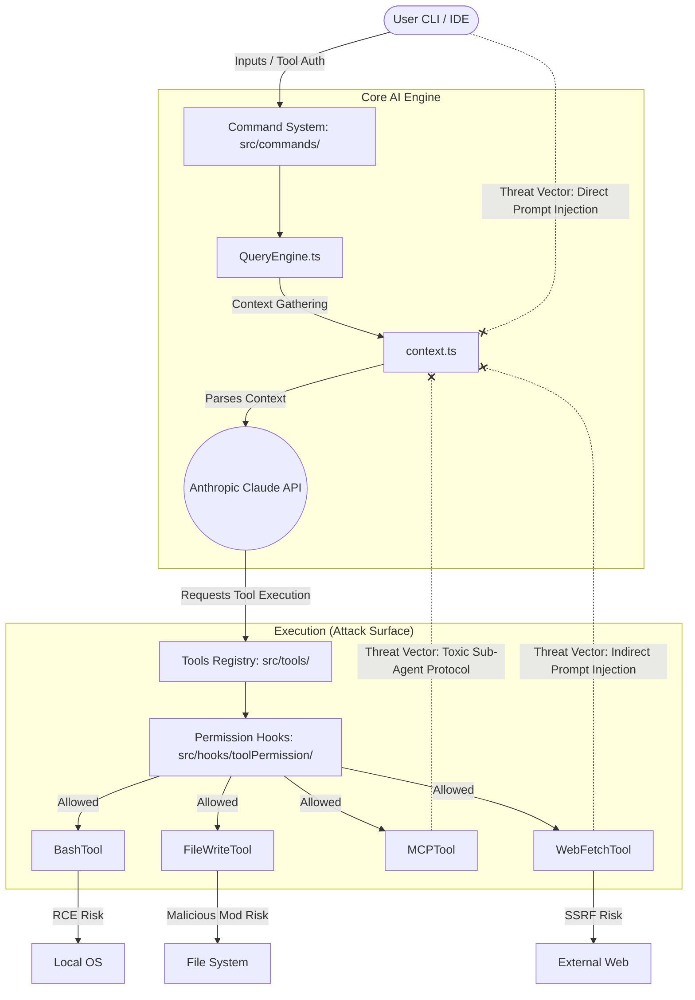

# Enterprise AI Security Research: Dissecting Claude Code Architecture

As a **Cyber Security Engineer**, my primary objective with this repository is to analyze the underlying architecture of modern, highly-privileged AI agents. This research focuses on securing chatbot environments, comprehensively understanding "jailbreak" mechanics (direct and indirect prompt injections), and evaluating how enterprise AI solutions isolate sensitive host data. 

By deconstructing the tool execution pipelines, access permissions, and integration layers, this repository serves to identify potential attack vectors—such as Remote Code Execution (RCE), Server-Side Request Forgery (SSRF), and malicious sub-agent protocols—bridging the gap between theoretical AI security and practical production implementations.

## Threat Model & Attack Surface Diagram

Below is the architectured threat model visualizing the isolation between the Core AI Engine and the Tool Execution Layer, mapping out critical vulnerabilities.


<details>
<summary>View Mermaid Source</summary>


</details>

## Technical Overview & Context

This codebase represents the real-world architecture of Anthropic's Claude Code CLI. Claude Code is a terminal-native tool designed for complex software engineering tasks. Analyzing this code provides a rare, massive-scale environment for security audits and vulnerability research.

- **Incident Context**: The initial code was obtained via an npm `.map` file leakage (discovered on 2026-03-31).
- **Language**: TypeScript
- **Runtime**: Bun
- **Terminal UI**: React + Ink
- **Scale**: ~1,900 files, 512,000+ lines of code

## Directory Structure

```text
src/
|- main.tsx                 # Entrypoint (Commander.js-based CLI parser)
|- commands.ts              # Command registry
|- tools.ts                 # Tool registry
|- Tool.ts                  # Tool type definitions
|- QueryEngine.ts           # LLM query engine (core Anthropic API caller)
|- context.ts               # System/user context collection
|- cost-tracker.ts          # Token cost tracking
|
|- commands/                # Slash command implementations (~50)
|- tools/                   # Agent tool implementations (~40)
|- components/              # Ink UI components (~140)
|- hooks/                   # React hooks
|- services/                # External service integrations
|- screens/                 # Full-screen UIs (Doctor, REPL, Resume)
|- types/                   # TypeScript type definitions
|- utils/                   # Utility functions
|
|- bridge/                  # IDE integration bridge (VS Code, JetBrains)
|- coordinator/             # Multi-agent coordinator
|- plugins/                 # Plugin system
|- skills/                  # Skill system
|- keybindings/             # Keybinding configuration
|- vim/                     # Vim mode
|- voice/                   # Voice input
|- remote/                  # Remote sessions
|- server/                  # Server mode
|- memdir/                  # Memory directory (persistent memory)
|- tasks/                   # Task management
|- state/                   # State management
|- migrations/              # Config migrations
|- schemas/                 # Config schemas (Zod)
|- entrypoints/             # Initialization logic
|- ink/                     # Ink renderer wrapper
|- buddy/                   # Companion sprite (Easter egg)
|- native-ts/               # Native TypeScript utils
|- outputStyles/            # Output styling
|- query/                   # Query pipeline
+- upstreamproxy/           # Proxy configuration
```

## Core Architecture

### 1. Tool System (src/tools/)

Every tool Claude Code can invoke is implemented as a self-contained module. Each tool defines its input schema, permission model, and execution logic.

| Tool | Description |
|---|---|
| BashTool | Shell command execution |
| FileReadTool | File reading (images, PDFs, notebooks) |
| FileWriteTool | File creation / overwrite |
| FileEditTool | Partial file modification (string replacement) |
| GlobTool | File pattern matching search |
| GrepTool | ripgrep-based content search |
| WebFetchTool | Fetch URL content |
| WebSearchTool | Web search |
| AgentTool | Sub-agent spawning |
| SkillTool | Skill execution |
| MCPTool | MCP server tool invocation |
| LSPTool | Language Server Protocol integration |
| NotebookEditTool | Jupyter notebook editing |
| TaskCreateTool / TaskUpdateTool | Task creation and management |
| SendMessageTool | Inter-agent messaging |
| TeamCreateTool / TeamDeleteTool | Team agent management |
| EnterPlanModeTool / ExitPlanModeTool | Plan mode toggle |
| EnterWorktreeTool / ExitWorktreeTool | Git worktree isolation |
| ToolSearchTool | Deferred tool discovery |
| CronCreateTool | Scheduled trigger creation |
| RemoteTriggerTool | Remote trigger |
| SleepTool | Proactive mode wait |
| SyntheticOutputTool | Structured output generation |

### 2. Command System (src/commands/)

User-facing slash commands invoked with / prefix.

| Command | Description |
|---|---|
| /commit | Create a git commit |
| /review | Code review |
| /compact | Context compression |
| /mcp | MCP server management |
| /config | Settings management |
| /doctor | Environment diagnostics |
| /login / /logout | Authentication |
| /memory | Persistent memory management |
| /skills | Skill management |
| /tasks | Task management |
| /vim | Vim mode toggle |
| /diff | View changes |
| /cost | Check usage cost |
| /theme | Change theme |
| /context | Context visualization |
| /pr_comments | View PR comments |
| /resume | Restore previous session |
| /share | Share session |
| /desktop | Desktop app handoff |
| /mobile | Mobile app handoff |

### 3. Service Layer (src/services/)

| Service | Description |
|---|---|
| api/ | Anthropic API client, file API, bootstrap |
| mcp/ | Model Context Protocol server connection and management |
| oauth/ | OAuth 2.0 authentication flow |
| lsp/ | Language Server Protocol manager |
| analytics/ | GrowthBook-based feature flags and analytics |
| plugins/ | Plugin loader |
| compact/ | Conversation context compression |
| policyLimits/ | Organization policy limits |
| remoteManagedSettings/ | Remote managed settings |
| extractMemories/ | Automatic memory extraction |
| tokenEstimation.ts | Token count estimation |
| teamMemorySync/ | Team memory synchronization |

### 4. Bridge System (src/bridge/)

A bidirectional communication layer connecting IDE extensions (VS Code, JetBrains) with the Claude Code CLI.

- bridgeMain.ts - Bridge main loop
- bridgeMessaging.ts - Message protocol
- bridgePermissionCallbacks.ts - Permission callbacks
- replBridge.ts - REPL session bridge
- jwtUtils.ts - JWT-based authentication
- sessionRunner.ts - Session execution management

### 5. Permission System (src/hooks/toolPermission/)

Checks permissions on every tool invocation. Either prompts the user for approval/denial or automatically resolves based on the configured permission mode (default, plan, bypassPermissions, auto, etc.).


## Key Files in Detail

### QueryEngine.ts (~46K lines)

The core engine for LLM API calls. Handles streaming responses, tool-call loops, thinking mode, retry logic, and token counting.

### Tool.ts (~29K lines)

Defines base types and interfaces for all tools - input schemas, permission models, and progress state types.

### commands.ts (~25K lines)

Manages registration and execution of all slash commands. Uses conditional imports to load different command sets per environment.

### main.tsx

Commander.js-based CLI parser + React/Ink renderer initialization. At startup, parallelizes MDM settings, keychain prefetch, and GrowthBook initialization for faster boot.

## Tech Stack

| Category | Technology |
|---|---|
| Runtime | Bun |
| Language | TypeScript (strict) |
| Terminal UI | React + Ink |
| CLI Parsing | Commander.js (extra-typings) |
| Schema Validation | Zod v4 |
| Code Search | ripgrep (via GrepTool) |
| Protocols | MCP SDK, LSP |
| API | Anthropic SDK |
| Telemetry | OpenTelemetry + gRPC |
| Feature Flags | GrowthBook |
| Auth | OAuth 2.0, JWT, macOS Keychain |

## Disclaimer

This repository archives source code that was leaked from Anthropic's npm registry on 2026-03-31. All original source code is the property of Anthropic.
